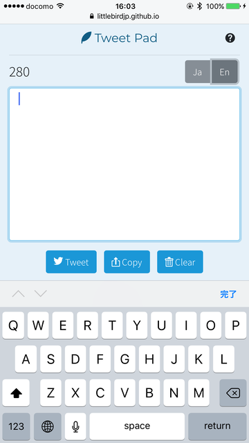

# Tweet Pad

"Tweet Pad" is a web app for writing draft tweets.

## URL

https://littlebirdjp.github.io/tweet-pad/

## Usage

1. Write a text on the input form. Rest character number that can post to Twitter will be displayed above.  
(one-byte character is counted as 1, and two-byte character as 2)
2. Click "Tweet" button if you finish drafting. It will be open the Twitter app and you can post a tweet directly.
3. Click "Copy" button if you save drafts to other memo app or cloud services. It will copied in to the clipboard.
4. Click "Clear" button if you want to delete all texts and rewrite again.

## Language Support

- Click "Ja" button if you want to use Japanese language.  
Rest character number is counted one-byte character as 0.5, and two-byte character as 1, in Japanese mode.
- Click "En" button if you want to return to English mode.

Language mode is auto detected based on browser language settings as default.  
(Japanese mode is activated when you use Japanese or Chinese and Korean languages)

## Debug Mode

You can use debug mode to append a parameter `debug=true` at last of the URL.  
In this mode you can try test codes for customization.

https://littlebirdjp.github.io/tweet-pad/?debug=true

## Issues and Pull Requests

Issues and Pull Requests are welcome.  
Feel free to contribute for this repository.

https://github.com/littlebirdjp/tweet-pad/issues
